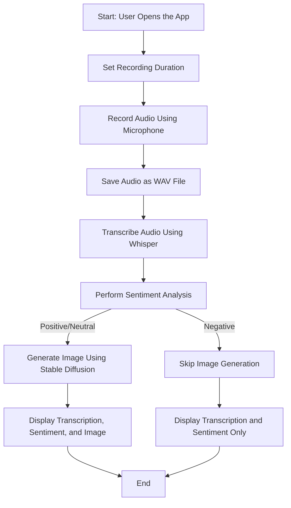

# Speech-to-Image-Live-Conversion-using-Deep-Learning_Infosys_Internship_Oct2024

The objective of this project is to develop a deep learning model that can convert spoken descriptions into corresponding images in real-time.
This project is a **Speech-to-Image Generator** that takes audio input, transcribes it using a Whisper model, analyzes the sentiment of the transcription, and generates an image using Stable Diffusion. The application is built using Python and Streamlit.

---

## Features
- **Audio Recording:** Record audio through your microphone.
- **Transcription:** Convert recorded audio to text using the Whisper model.
- **Sentiment Analysis:** Classify the sentiment of the transcribed text.
- **Image Generation:** Generate an image based on the transcription if the sentiment is positive or neutral.

---

## System Flow

### Detailed Workflow:
The application follows these steps:

1. **Audio Input:**
   - The user sets the recording duration.
   - The application records audio using the `sounddevice` library.
   - The recorded audio is saved as a `.wav` file.

2. **Transcription (Whisper Model):**
   - The saved audio is loaded and preprocessed.
   - The Whisper model transcribes the audio into text.

3. **Sentiment Analysis:**
   - The transcribed text is passed to a sentiment analysis pipeline.
   - The sentiment is classified as either **Positive**, **Neutral**, or **Negative**.

4. **Image Generation (Stable Diffusion):**
   - If the sentiment is **Positive** or **Neutral**, the transcription is passed to the Stable Diffusion pipeline, which generates an image based on the transcription.
   - If the sentiment is **Negative**, no image is generated, and a warning is displayed to the user.

5. **Display Results:**
   - The transcription and sentiment analysis results are displayed.
   - If the sentiment is **Positive** or **Neutral**, the generated image is also displayed alongside the results.

---

## Flowchart




---

## Installation

1. **Clone the repository:**
   ```bash
   git clone https://github.com/AabidMK/Speech-to-Image-Live-Conversion-using-Deep-Learning_Infosys_Internship_Oct2024.git
   cd Speech-to-Image-Live-Conversion-using-Deep-Learning_Infosys_Internship_Oct2024


2. **Create a virtual environment (optional but recommended):**
   ```bash
   python -m venv venv
   venv\Scripts\activate     # On Windows
   source venv/bin/activate  # On macOS/Linux

3. **Install dependencies:**
   ```bash
   pip install -r requirements.txt
   ```

---

## How to Run

1. **Start the Streamlit application:**
   ```bash
   streamlit run speech_to_image.py
   ```

2. **Interact with the app:**
   - Set the recording duration using the slider.
   - Click **Start Recording 🎙️** to record your audio.
   - View the transcription and sentiment analysis.
   - If the sentiment is positive/neutral, view the generated image.

---

## Note
- The application will not generate an image if the sentiment is classified as negative.
- Ensure your microphone is functioning correctly for the audio recording.

---

## Troubleshooting
1. **CUDA Error:** 
   - If GPU is not available, the application will default to CPU, which might slow down inference. 
   - Verify your PyTorch installation supports CUDA.

2. **Model Loading Issues:** 
   - Confirm the paths for the Whisper and Stable Diffusion models are correct.
   - Ensure the models are downloaded and accessible.

3. **Dependencies:** 
   - Use the exact versions of dependencies listed in `requirements.txt` to avoid compatibility issues.

---

## Contributing
Feel free to fork this repository and make contributions. Create a pull request with your changes for review.

---

## License
This project is licensed under the MIT License. See `LICENSE` for details.

---


